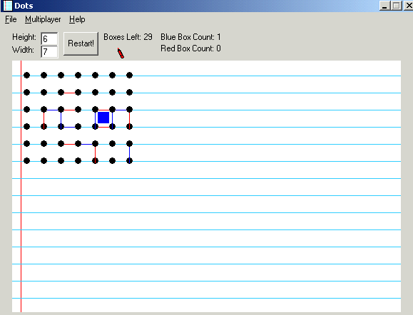



## Dots

### Description

If you remeber that game back in school no, not tic tac toe, but DOTS! Make dots, draw lines, make boxes. Whoever has more boxes at the end wins type of deal. Well this is it! DOTS! Useful code for learning some internet programming as well using the Winsock control. Has icons in menus (using cool menu) and has a chatroom!
 
### More Info
 
Requires MS Common Controls

Something is wrong with me (module.over) sub

It ends the program but it also ends VB (atleast for me) So you may want to look into that function and see if you can have it terminate without terminating the VB IDE

             |
---                |---
**Submitted On**   |2001-02-12 18:29:40
**By**             |[Kunal Johar](https://github.com/Planet-Source-Code/PSCIndex/blob/master/ByAuthor/kunal-johar.md)
**Level**          |Intermediate
**User Rating**    |5.0 (25 globes from 5 users)
**Compatibility**  |VB 6\.0
**Category**       |[Games](https://github.com/Planet-Source-Code/PSCIndex/blob/master/ByCategory/games__1-38.md)
**World**          |[Visual Basic](https://github.com/Planet-Source-Code/PSCIndex/blob/master/ByWorld/visual-basic.md)
**Archive File**   |[CODE\_UPLOAD148722122001\.zip](https://github.com/Planet-Source-Code/kunal-johar-dots__1-18508/archive/master.zip)

